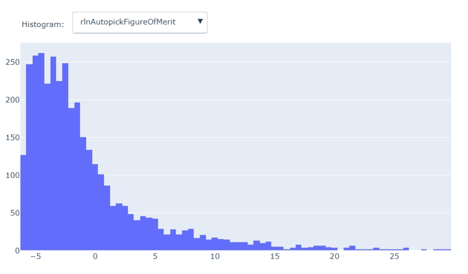
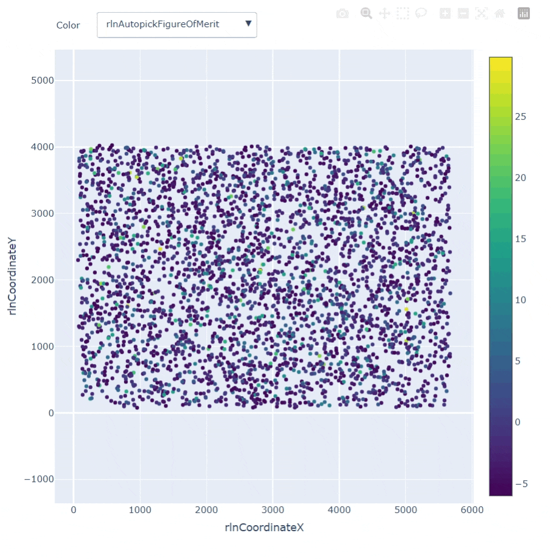
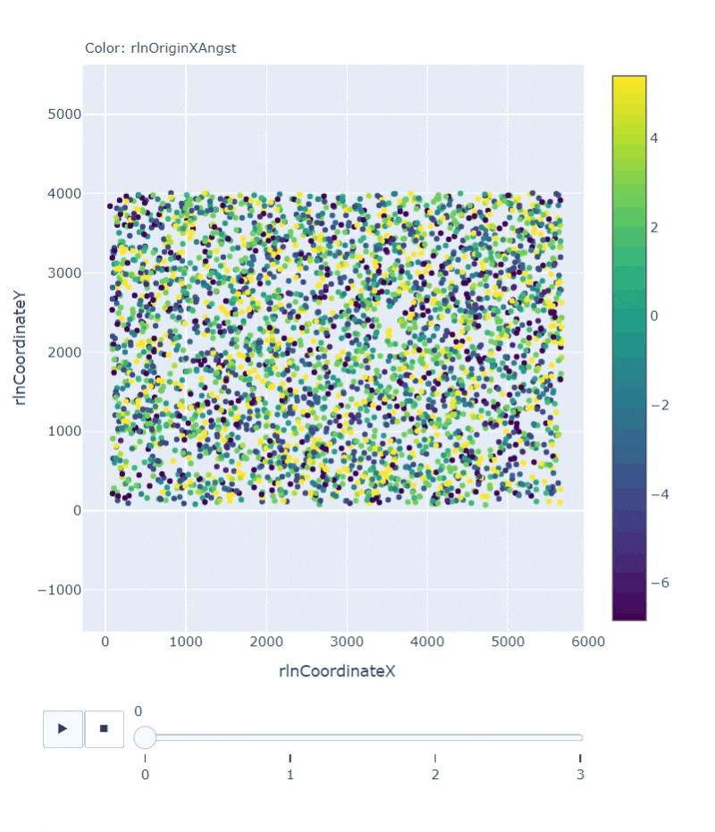

# CryoEM-viztools

**Better visualization for cryo-EM. Still in dev and welcome to any suggestions and contributions!**

**INPUT**: Usual cryo-EM file formats, including `mrc(s)` and `star` files.  
**OUTPUT**: Either images or static html file.

Heavily uses [Plotly](https://plotly.com/) to render interactive visualizations.

Besides making format conversions, this repo tries provide useful visualizations of the information in the `star` files outputted by [RELION](https://github.com/3dem/relion) and other software.

Examples of the generated html files can be found in `./samples/output`. 

A few examples:

*3D plot of orientation angles of particles in a half-sphere, with selectable attribute (color-coded) in the star file:*

*Histogram plot with selectable attribute in the star file:*

*Scatter plot with predefined X and Y axis and selectable attribute (color-coded) in the star file:*

*Scatter plot with predefined X and Y axis and a color-code attribute in multiple star files (for tracking the relationships of as many as three attributes in a process with multiple iterations, e.g. 3D refinement):*

*Micrograph image overlaid with picked particle coordinates, with sliders for merit-based thresholding and changable diameters:*

